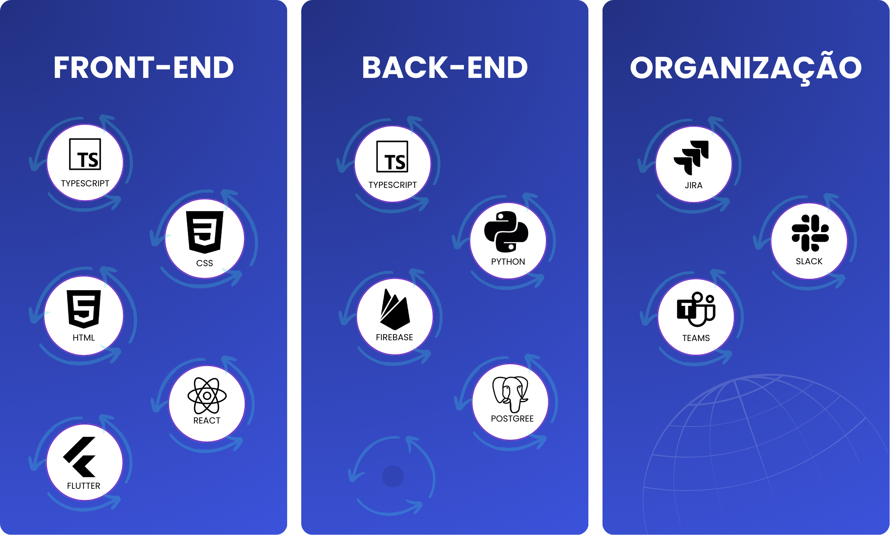

<a href="#descricao"> 🎯 Descrição do projeto </a> |
<a href="#requisitos-funcionais"> 📚 Requisitos Funcionais </a> |
<a href="#requisitos-nao-funcionais"> 📚 Requisitos Não Funcionais </a> |
<a href="#product-backlog"> 📖 Product Backlog </a> |
<a href="#dor"> DoR </a> |
<a href="#dod"> DoD </a> |
<a href="#sprints"> 📌 Sprints </a> |
<a href="#tecnologias"> 💻 Tecnologias </a> |
<a href="#padroes-de-commit"> 📨 Padrões de Commit </a> |
<a href="#membros"> 👥 Membros </a> 

<h2 id='descricao'> 🎯 Descrição do projeto </h2>

A Base Administrativa da Guarnição de Caçapava enfrenta desafios no controle interno de materiais, especialmente no almoxarifado e na farmácia militar, devido ao uso de processos manuais que geram retrabalho, atrasos e aumentam o risco de erros.

Para resolver essa dor, o projeto propõe o desenvolvimento de um aplicativo, voltado para o gerenciamento do controle de estoque do almoxarifado e da farmácia. A solução contará com uma interface simples e responsiva, autenticação segura via login, leitura de QR Code para identificação rápida dos itens e alertas automáticos para evitar perdas ou desabastecimento.

Com esse sistema, a gestão de materiais se tornará mais ágil, eficiente e rastreável, permitindo uma visualização clara dos estoques e fornecendo relatórios estratégicos com base em dados reais para embasar decisões logísticas e operacionais.

<h2 id='requisitos-funcionais'> 📚 Requisitos Funcionais </h2>

| Número | Descrição |
|--------|-----------|
| RF1 | Cadastro de novo produtos manualmente e via QR Code. |
| RF2 | Geração automática de QR Code para impressão. |
| RF3 | Cadastro de novos pedidos de materiais para almoxarifado e farmácia. |
| RF4 | Listagem de pedidos abertos e finalizados. |
| RF5 | Histórico de movimentações por item. |
| RF6 | Visualização e filtragem do inventário. |
| RF7 | Ajuste manual de estoque. |
| RF8 | Exclusão de item do inventário. |
| RF9 | Alertas de estoque mínimo. |
| RF10 | Filtro por grupo, nome, quantidade e estoque mínimo. |
| RF11 | Relatórios de consumo médio por período. |
| RF12 | Estimativa de previsão de demanda. |
| RF13 | Cadastro e gerenciamento de usuários. |
| RF14 | Perfil do usuário com visualização e edição de dados. |
| RF15 | Disparo de e-mails de cobrança para fornecedores. |

<h2 id='requisitos-nao-funcionais'> 📚 Requisitos Não Funcionais </h2>

| Número | Descrição |
|--------|-----------|
| RNF1 | Manual do usuário. |
| RNF2 | Uso de inteligência artificial para gestão de alertas. |

<h2 id='product-backlog'> 📖 Product Backlog </h2>

<table>
  <thead>
    <tr align="center">
      <th>Rank</th>
      <th>Prioridade</th>
      <th>User Story</th>
      <th>Estimativa</th>
      <th>Sprint</th>
    </tr>
  </thead>
  <tbody>
    <tr><td>1</td><td>ALTA</td><td>Como usuário, quero fazer login com e-mail e senha, para acessar o sistema de forma segura.</td><td>3</td><td>1</td></tr>
    <tr><td>2</td><td>ALTA</td><td>Como administrador, quero cadastrar manualmente novos produtos com informações completas, para manter o estoque atualizado.</td><td>5</td><td>1</td></tr>
    <tr><td>3</td><td>ALTA</td><td>Como administrador, quero escanear o QR Code de um item existente, para atualizar a quantidade de itens no estoque.</td><td>5</td><td>1</td></tr>
    <tr><td>4</td><td>ALTA</td><td>Como usuário, quero cadastrar pedidos de materiais, para solicitar itens do almoxarifado ou a farmácia.</td><td>5</td><td>1</td></tr>
    <tr><td>5</td><td>ALTA</td><td>Como administrador, quero visualizar todos os pedidos feitos, para a retiradas de materiais.</td><td>5</td><td>1</td></tr>
    <tr><td>6</td><td>ALTA</td><td>Como administrador, quero visualizar todos os itens do estoque com filtros avançados, para gerenciar de forma prática e rápida.</td><td>8</td><td>1</td></tr>
    <tr><td>7</td><td>ALTA</td><td>Como administrador, quero poder excluir um item do inventário, para remover produtos descontinuados.</td><td>2</td><td>1</td></tr>
    <tr><td>8</td><td>ALTA</td><td>Como administrador, quero cadastrar e gerenciar usuários com níveis de acesso, para controlar quem pode fazer alterações no sistema.</td><td>8</td><td>1</td></tr>
    <tr><td>9</td><td>ALTA</td><td>Como usuário, quero poder clicar no botão “imprimir" para obter o QR Code impresso</td><td>2</td><td>1</td></tr>
    <tr><td>10</td><td>ALTA</td><td>Como administrador, quero cadastrar, editar, visualizar e excluir seções (instituições) e vincular cada pedido a uma seção, para organizar os pedidos por área/entidade e facilitar a gestão.</td><td>5</td><td>1</td></tr>
    <tr><td>11</td><td>ALTA</td><td>Como administrador, quero editar as informações do produto, para corrigir erros ou atualizar valores.</td><td>3</td><td>1</td></tr>
    <tr><td>12</td><td>MÉDIA</td><td>Como administrador, quero receber alertas de produtos com estoque próximo ou abaixo do mínimo, para evitar desabastecimento.</td><td>5</td><td>2</td></tr>
    <tr><td>13</td><td>MÉDIA</td><td>Como administrador, quero ver a média de consumo dos produtos em um intervalo de tempo, para prever compras futuras.</td><td>8</td><td>2</td></tr>
    <tr><td>14</td><td>MÉDIA</td><td>Como usuário, quero visualizar e editar meu perfil, para manter meus dados atualizados.</td><td>2</td><td>2</td></tr>
    <tr><td>15</td><td>MÉDIA</td><td>Como usuário, quero poder visualizar o histórico do inventário, para controlar as entradas e saídas daquele produto</td><td>5</td><td>2</td></tr>
    <tr><td>16</td><td>MÉDIA</td><td>Como usuário, quero poder visualizar o histórico de alterações dos produtos e quem realizou a alteração</td><td>8</td><td>2</td></tr>
    <tr><td>17</td><td>MÉDIA</td><td>Como administrador, quero exportar os dados da dashboard em formato de excel e PDF</td><td>8</td><td>2</td></tr>
    <tr><td>18</td><td>MÉDIA</td><td>Como administrador, quero poder disparar e-mail de cobranças para os fornecedores</td><td>8</td><td>2</td></tr>
    <tr><td>19</td><td>MÉDIA</td><td>Como administrador, quero poder adicionar em massa vários usuários por meio de uma planilha de excel, contendo as informações de nome, e-mail e senha.</td><td>13</td><td>2</td></tr>
    <tr><td>20</td><td>MÉDIA</td><td>Como administrador, quero acessar o dashboard por uma plataforma web para agilidade</td><td>5</td><td>2</td></tr>
    <tr><td>21</td><td>MÉDIA</td><td>Como administrador, quero cadastrar usuários por uma plataforma web para agilidade</td><td>5</td><td>2</td></tr>
    <tr><td>22</td><td>BAIXA</td><td>Como usuário, quero poder alterar minha senha</td><td>2</td><td>3</td></tr>
    <tr><td>23</td><td>BAIXA</td><td>Como usuário, quero poder cadastrar, visualizar, editar e excluir os pacientes no sistema</td><td>8</td><td>3</td></tr>
    <tr><td>24</td><td>BAIXA</td><td>Como usuário, quero poder cadastrar, visualizar, editar e excluir os tipos de exames no sistema</td><td>5</td><td>3</td></tr>
    <tr><td>25</td><td>BAIXA</td><td>Como usuário, quero poder agendar exames para os pacientes</td><td>5</td><td>3</td></tr>
    <tr><td>26</td><td>BAIXA</td><td>Como usuário, quero poder atualizar o status do agendamento para confirmado, cancelado e não compareceu</td><td>3</td><td>3</td></tr>
    <tr><td>27</td><td>BAIXA</td><td>Como usuário, quero poder atualizar o status do exame dos pacientes para agendado, realizado, disponível e retirado</td><td>5</td><td>3</td></tr>
    <tr><td>28</td><td>BAIXA</td><td>Como paciente, quero poder visualizar os meus agendamentos e datas de retiradas dos exames</td><td>3</td><td>3</td></tr>
    <tr><td>29</td><td>BAIXA</td><td>Como paciente, quero poder visualizar os meus agendamentos e datas de retiradas dos exames</td><td>2</td><td>3</td></tr>
    <tr><td>30</td><td>BAIXA</td><td>Como paciente, quero poder cancelar um agendamento</td><td>2</td><td>3</td></tr>
    <tr><td>31</td><td>BAIXA</td><td>Como paciente, quero poder visualizar informações de como se preparar para o procedimento selecionado</td><td>8</td><td>3</td></tr>
  </tbody>
</table>

<h2 id='dor'> DoR (Definitions of Ready) </h2>

### User Stories
- Definidas e compreendidas por todos.
- Pequenas o suficiente para serem feitas em uma sprint.

### Critério de Aceitação
- Mensurável e testável.
- Descreve claramente quando a funcionalidade está completa.

### Modelo de Dados
- Definido e documentado.
- Campos, tipos de dados e relações claramente especificados.

<h2 id='dod'> DoD (Definition of Done) </h2>

### Código
- Implementa todos os critérios de aceitação.
- Todos os testes implementados e executados com sucesso.

### Commit
- Documentados com mensagens claras e descritivas.
- Seguem o padrão de nomenclatura acordado pela equipe.

### Mockups
- Mockups na interface funcionam conforme esperado.
- Experiência do usuário corresponde aos critérios definidos.

### Guia de Instalação
- Detalha todos os passos para configuração e instalação.
- Inclui requisitos de sistema, dependências e configurações de software/hardware.

<h2 id='sprints'> 📌 Sprints </h2>

<table>
  <thead>
    <tr align="center">
      <th>Sprints</th>
      <th>Data de Início</th>
      <th>Data de Término</th>
      <th>Documentos</th>
      <th>Status</th>
    </tr>
  </thead>
 <tbody>
  <tr align="center">
    <td>01</td>
    <td>08/09/2025</td>
    <td>28/09/2025</td>
    <td><a href="https://github.com/Sync-FATEC/API-2025.2-5SEM/tree/main/sprints/sprint01/sprint01.md">Relatório</a></td> 
    <td>🔁</td>
  </tr>
  <tr align="center">
    <td>02</td>
    <td>06/10/2025</td>
    <td>26/10/2025</td>
    <td></td> 
    <td>❌</td>
  </tr>
  <tr align="center">
    <td>03</td>
    <td>03/11/2025</td>
    <td>24/11/2025</td>
    <td></td> 
    <td>❌</td>
  </tr>
</tbody>
</table>

<h2 id='tecnologias'> 💻 Tecnologias </h2>

<h2 id='padroes-de-commit'> 📨 Padrões de Commit </h2>

<h2 id='membros'> 👥 Membros </h2>

| Foto | Nome | Função | Github | Linkedin |
| :---------: | :---------: | :---------------------: | :-----------------: | :-------: |
|  | José Eduardo Fernandes | Scrum Master |  |  |
|  | Ana Laura Moratelli | Product Owner |  |  |
|  | Arthur Karnas | Desenvolvedor |  |  |
|  | Erik Yokota | Desenvolvedor |  |  |
|  | Filipe Colla | Desenvolvedor |  |  |
|  | João Gabriel Solis | Desenvolvedor |  |  |
|  | Kauê Francisco | Desenvolvedor |  |  |

<a href='#topo'> Voltar ao topo </a>

